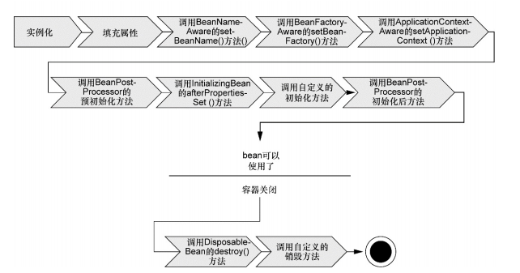

#Spring启动

----

	​​
##bean的生命周期

如图所示：

1. **Spring 对bean进行实例化；**
2.  **Spring 将值和bean的引用注入到bean对应的属性中** 
3.  **如果bean实现了BeanNameAware接口，Spring将Bean的ID传递给setBeanName()方法；** 
4. **如果bean实现了BeanFactoryAware接口，Spring将调用SetBeanFactory()方法，将BeanFactory容器示例传入；**
5. **如果bean实现了ApplicationContextAware接口，Spring将调用setApplicationContext()方法，将bean所在的应用上下文的引用传入进来；**
6.  **如果bean实现了BeanPostProcessor接口，Spring将调用它们的postProcessBeforeInitialization()方法；** 
7. **如果bean实现了InitializingBean接口，Spring将调用它们的afterPropertiesSet()方法。类似的，如果bean使用init-method声明了初始化方法，该方法也会被调动；**
8. **如果biean实现了BeanPostProcessor接口，Spring将调用它们的postProcessAfterInitialization()方法；**
9. **此时，bean已经准备就绪，可以被应用程序使用了，它们将一直驻留在应用上下文中，直到该应用上下文被销毁；**
10. **如果bean实现了DisposableBean接口，Spring将调用他的destroy（）接口方法。同样，如果bean使用destroy-method声明了销毁方法，该方法也会被调用；**
