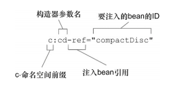

##装配bean

###1.1Spring配置方案

1. 在XML中显式的配置
2. 在JAVA中显式的配置
3. 隐式的自动发现和自动装配

###1.2自动化装配bean
Spring从两个角度来实现自动化装配：
- 组件扫描(component scanning):Spring会自动发现应用上下文中所创建的bean
- 自动装配(autowiring):Spring自动满足bean之间的依赖

对应的，自动化装配bean需要两个步骤:

__1. 使组件可以被扫描__
- 启用组件扫描
    >XML形式：

    `<context:component-scan base-package="xxx.xxx"/>`
 
    >注解形式：在配置类上添加注解

    `@ComponentScan(basePackages="xxx.xxx")`

    `@ComponentScan(basePackages={"xxx.xxx","yyy.yyy"})`
    
    >>  括号和括号中内容可省略，省略时表示扫描的基础包为当前类所在包

    >>  可以配置多个基础包

    `@ComponentScan(basePackageClasses = {CompactDisc.class,CDPlayerTest.class})`
    >>将会以设置的类所在的包作为基础包扫描
- 创建可被发现的bean(将bean交给Spring管理)
    
    >在类上添加注解
    `@Component("xxxx")`
    >>括号和括号中内容可省略，省略时表示bean的ID为类名第一个字母小写
        
    >>同类注解
    >>`@Controller //标注控制层`

    >>`@Service //标注服务层`

    >>`@Repository //标注DAO层`
    
__2. 自动装配__

使用@AutoWired 自动装配:
1. 添加在任何需要传递参数的方法上(构造器、set方法、普通方法)
2. 添加在类的类属性(静态属性)、对象属性上

###1.3使用Java代码装配bean
如果想要将第三方库中的组件装配到你的应用中，在这种情况下，是没有办法在它的类上添加@Component和@Autowired注解的，因此就不能使用自动化装配方案了

使用：
1. 使用`@Configuration`创建配置类
2. 使用在配置类中使用`@Bean`声明bean

    > `@Bean`默认bean ID为方法名,可使用`@Bean(name="xxxx)`为bean 设置特殊的ID

###1.4使用XML装配bean 

1. **声明一个简单bean**

    ```
    <?xml version="1.0" encoding="UTF-8"?>
     <beans xmlns="http://www.springframework.org/schema/beans"
            xmlns:xsi="http://www.w3.org/2001/XMLSchema-instance"
            xsi:schemaLocation="http://www.springframework.org/schema/beans http://www.springframework.org/schema/beans/spring-beans.xsd">
     
         <!--声明一个简单的bean-->
         <bean id="sgtPeppers" class="com.wwr.chapter2.part2_4.SgtPeppers"></bean>
         
     </beans>
     ```
2. **借助构造器注入初始化bean**
    >`<constructor-arg>`元素
    ```
    <!--使用构造器注入bean-->
    <bean id="cdPlayer" class="com.wwr.chapter2.part2_4.MediaPlayer">
        <constructor-arg ref="compactDisc"/>
    </bean>
    ```
    >使用Spring3.0引入的c-命名空间
    ```
    <!--使用c-命名空间声明构造器参数，使用前需要先引入c命名空间-->
    <!--使用c-命名空间无法注入集合类型-->
    <bean
            id="anthorCdPlayer"
            class="com.wwr.chapter2.part2_4.MediaPlayer"
            c:cd-ref="compactDisc"
    ></bean>
    ```
    
3. **设置属性**
    >使用`<property>`标签为属性注入值
    ```
    <!--使用property注入属性值-->
    <bean id="specialCdPlayer" class="com.wwr.chapter2.part2_4.SpecialCDPlayer">
        <property name="cd" ref="compactDisc"></property>
    </bean>
    ```
    >使用p-命名空间为属性注入值
    ```
    <!--使用p命名空间注入属性值，使用前需要先引入p命名空间-->
    <!--使用p-命名空间无法直接注入集合类型-->
    <bean
            id="anothorSpecialCdPlayer"
            class="com.wwr.chapter2.part2_4.SpecialCDPlayer"
            p:cd-ref="compactDisc"
    ></bean>
    ```